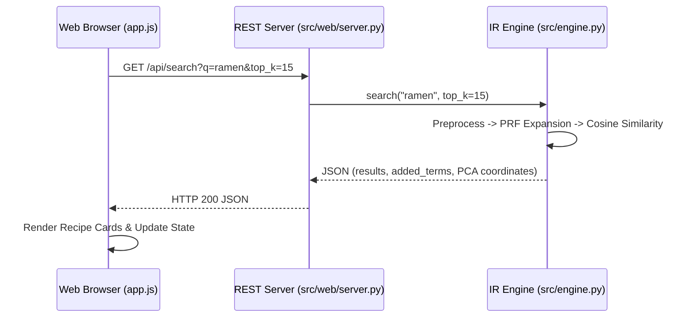

# 🏗️ System Architecture & Engineering Design

This document details the software architecture, data processing pipeline, mathematical foundations, and component interactions of the **Japanese Foods Information Retrieval (IR) System**.

---

## 1. High-Level Architecture Diagram

```mermaid
graph TD
    subgraph Data Acquisition & Preprocessing Layer
        A1["Multi-Source Ingestion<br/>(url_scraper.py)"] --> A2["Raw CSV Storage<br/>(data/raw/Japan_Food_Ingredients_Full.csv)"]
        A2 --> A3["NLP Preprocessing & Stopwords<br/>(text_cleaner.py)"]
        A3 --> A4["Cleaned Corpus<br/>(data/processed/Japan_Food_Ingredients_Cleaned.csv)"]
        A5["Curated Authentic Catalog<br/>(default_data.py)"] -.->|Self-Healing Fallback| A4
    end

    subgraph Core IR & Indexing Engine (engine.py)
        A4 --> B1["Unified IR Engine<br/>(JapaneseFoodIREngine)"]
        B1 --> B2["TF-IDF Vector Space Model<br/>(Weighted Title 6x + Ingredients)"]
        B1 --> B3["Inverted Index<br/>(DF + Postings List)"]
        B1 --> B4["K-Means Clusterer<br/>(Adaptive K=6 Clusters)"]
        B4 --> B5["2D PCA Projection<br/>(Recipe Coordinates & Centroids)"]
    end

    subgraph Query Processing & Retrieval
        C1["User Query / Pantry List"] --> C2["Lemmatizer & Normalizer"]
        C2 --> C3["Pseudo-Relevance Feedback<br/>(Dynamic Query Expansion)"]
        C3 --> C4["Cosine Similarity Scoring"]
        B2 --> C4
        C4 --> C5["Ranked Results & Metrics Engine"]
        C5 -.->|Fallback on 0 Matches| C6["Substring & Overlap Matcher"]
    end

    subgraph Presentation & REST APIs
        B1 --> D1["Embedded REST Server<br/>(src/web/server.py)"]
        B1 --> D2["Streamlit Dashboard<br/>(app_streamlit.py)"]
        B1 --> D3["Terminal Search CLI<br/>(Model/VSM.py)"]
        D1 --> E1["Zen Minimalist Web UI<br/>(web/index.html + app.js)"]
    end
```

---

## 2. Pipeline Subsystems

### 2.1 Web Scraping & Ingestion Layer (`src/crawler/`)
- **URL Scraper (`src/crawler/url_scraper.py`)**: Fetches Japanese recipe links from Cookpad with automatic pagination. If Cloudflare challenges or network drops occur, it seamlessly falls back to TheMealDB Japanese API (with direct Cookpad URL mapping) and the built-in 100-recipe catalog.
- **Recipe Extractor (`src/crawler/recipe_scraper.py`)**: Traverses recipe URLs and extracts ingredients using regex class matching, with culinary knowledge-base fallback to guarantee valid ingredient strings.

### 2.2 Text Preprocessing & NLP Normalization Layer (`src/preprocessing/text_cleaner.py`)
- **Noise Stripping**: Alphanumeric filtering (`re.sub(r'[^a-z\s]', ' ', text)`).
- **Safe Tokenization**: NLTK `word_tokenize` with automatic regex fallback (`safe_tokenize`) for offline/restricted environments.
- **Culinary Stopword Elimination**: A custom domain dictionary filtering out 50+ cooking units, actions, and generic tokens (e.g., `cup`, `tbsp`, `minced`, `chopped`, `diced`, `serving`, `medium`, `quality`, `raw`).
- **Safe Lemmatization**: NLTK `WordNetLemmatizer` reducing inflections to base morphological forms with pass-through fallback.

---

## 3. Mathematical & Algorithmic Foundations

### 3.1 Document Representation & Title Weighting
To reflect the high semantic significance of the recipe title, the document text $D_i$ is constructed with a title weighting multiplier $\alpha = 6$:

$$D_i = \underbrace{(T_i \oplus \text{" "}) \times 6}_{\text{Title boosted } 6\times} \oplus I_i$$

where $T_i$ represents the cleaned title tokens and $I_i$ represents cleaned ingredient tokens.

### 3.2 Inverted Index Structure
For each unique vocabulary term $t \in V$:
```json
{
  "chicken": {
    "df": 36,
    "postings": [0, 2, 4, 6, 7, 8, 12, 17, 21]
  }
}
```
- **Document Frequency (DF)**: Number of recipes containing term $t$.
- **Postings List**: Array of 0-indexed document identifiers.

### 3.3 Dynamic Query Expansion (Pseudo-Relevance Feedback)
1. User provides initial query $\vec{q}$.
2. The engine computes initial Cosine Similarities against all documents.
3. Top 10 documents with similarity $> 0$ are analyzed for co-occurring ingredient concepts:
   $$\text{Concepts} = \bigcup_{d \in \text{Top-10}} \text{Tokens}(d_{\text{ingredients}})$$
4. Candidate terms $w \notin \vec{q}$ with frequency $\ge \max(\text{freq})$ are appended to $\vec{q}$ (up to $MAX=5$ terms).
5. Final retrieval is executed with $\vec{q}_{\text{expanded}}$.

### 3.4 K-Means Clustering & 2D PCA Dimensionality Reduction
- **Clustering**: $K$-Means clustering partitions the sparse TF-IDF matrix into $K=6$ culinary clusters using $k$-means++ initialization.
- **PCA Dimensionality Reduction**: The high-dimensional TF-IDF vectors ($100 \times |V|$) are mapped to a 2D coordinate space $(x, y)$ via Principal Component Analysis (PCA):
  $$\mathbf{X}_{2D} = \mathbf{X}_{\text{TF-IDF}} \mathbf{W}_2$$
- **Centroids**: The 6 cluster centroids are also projected onto the same 2D plane:
  $$\boldsymbol{\mu}_{2D, k} = \boldsymbol{\mu}_k \mathbf{W}_2$$

---

## 4. Web Application & Client-Server Architecture


